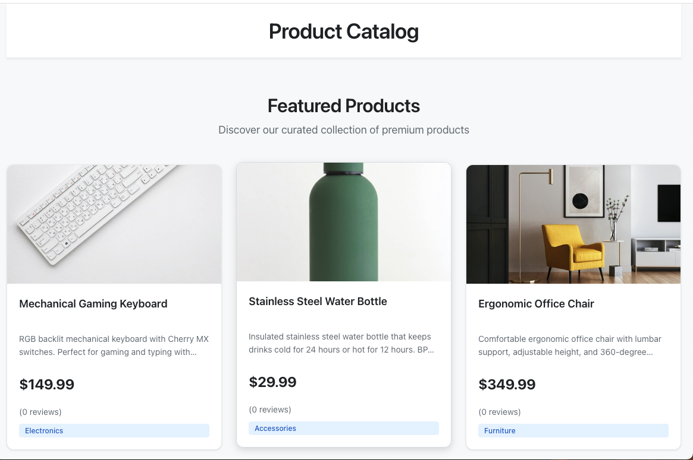
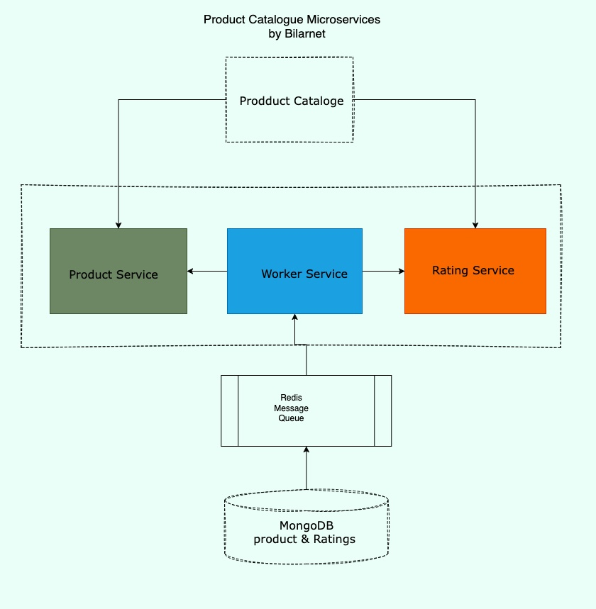

# Product Catalog & Ratings App

A microservices-based e-commerce application showcasing DevOps best practices including microservices architecture, containerization, CI/CD pipelines, and Kubernetes deployment.


)

## 🏗️ Architecture layout

This application demonstrates a microservices architecture with the following services:

- **Product Service** (Port 5000) - Manages product catalog CRUD operations
- **Ratings Service** (Port 5001) - Handles user ratings and publishes events
- **Worker Service** - Processes rating events and updates product averages
- **Frontend Service** (Port 3000) - React-based user interface
- **MongoDB** - Single instance with separate databases for products and ratings
- **Redis** - Message queue for asynchronous event processing

### Architecture Diagram



```
┌─────────────┐
│   Frontend  │ (React)
│   Service   │
└──────┬──────┘
       │
       ├──────────────┬──────────────┐
       │              │              │
┌──────▼──────┐ ┌─────▼──────┐ ┌────▼─────┐
│   Product   │ │  Ratings   │ │  Worker  │
│   Service   │ │  Service   │ │ Service  │
└──────┬──────┘ └─────┬──────┘ └────┬─────┘
       │              │              │
       └──────────────┴──────────────┘
                      │
            ┌─────────▼─────────┐
            │     MongoDB       │
            │  (products DB)    │
            │  (ratings DB)     │
            └─────────┬─────────┘
                      │
            ┌─────────▼─────────┐
            │      Redis         │
            │   (Message Queue)  │
            └────────────────────┘
```

## 🚀 Quick Start

### Prerequisites

- Docker and Docker Compose
- Node.js 18+ (for local development)
- MongoDB (if running services locally)
- Redis (if running services locally)

### Local Development with Docker Compose

1. **Clone the repository**
   ```bash
   git clone <repository-url>
   cd product-catalog-app
   ```

2. **Start all services**
   ```bash
   docker-compose up -d
   ```

3. **Access the application**
   - Frontend: http://localhost:3000
   - Product Service API: http://localhost:5002
   - Ratings Service API: http://localhost:5003
   - MongoDB: localhost:27017
   - Redis: localhost:6379


4. **Default Products**
   - The application automatically seeds 5 default products on startup
   - Products are only seeded if they don't already exist (by name)
   - This ensures consistent testing data every time you start the application

4. **View logs**
   ```bash
   docker-compose logs -f [service-name]
   ```

5. **Stop all services**
   ```bash
   docker-compose down
   ```

### Local Development (Without Docker)

1. **Start MongoDB and Redis**
   ```bash
   # MongoDB
   mongod

   # Redis
   redis-server
   ```

2. **Install dependencies for each service**
   ```bash
   # Product Service
   cd product-service
   npm install
   npm run dev

   # Ratings Service (new terminal)
   cd ratings-service
   npm install
   npm run dev

   # Worker Service (new terminal)
   cd worker-service
   npm install
   npm start

   # Frontend (new terminal)
   cd frontend
   npm install
   npm start
   ```

## 📁 Project Structure

```
product-catalog-app/
├── product-service/          # Product catalog microservice
│   ├── src/
│   │   ├── config/
│   │   ├── controllers/
│   │   ├── models/
│   │   ├── routes/
│   │   └── server.js
│   ├── Dockerfile
│   └── package.json
├── ratings-service/          # Ratings microservice
│   ├── src/
│   ├── Dockerfile
│   └── package.json
├── worker-service/           # Background worker service
│   ├── src/
│   ├── Dockerfile
│   └── package.json
├── frontend/                 # React frontend
│   ├── src/
│   ├── public/
│   ├── Dockerfile
│   └── package.json
├── infrastructure/
│   └── kubernetes/           # K8s manifests
├── .github/
│   └── workflows/           # CI/CD pipelines
├── docker-compose.yml
└── README.md
```

## 🔧 API Endpoints

### Product Service

- `GET /api/products` - List all products (supports query params: category, search, sort, page, limit)
- `GET /api/products/:id` - Get product by ID
- `POST /api/products` - Create new product
- `PUT /api/products/:id` - Update product
- `DELETE /api/products/:id` - Delete product
- `GET /health` - Health check

### Ratings Service

- `POST /api/ratings` - Submit a rating
- `GET /api/ratings/product/:productId` - Get ratings for a product
- `GET /api/ratings/user/:userId` - Get ratings by a user
- `DELETE /api/ratings/:id` - Delete a rating
- `GET /health` - Health check

## 🐳 Docker


### Build Individual Services

```bash
# Product Service
cd product-service
docker build -t product-service:latest .

# Ratings Service
cd ratings-service
docker build -t ratings-service:latest .

# Worker Service
cd worker-service
docker build -t worker-service:latest .

# Frontend
cd frontend
docker build -t product-catalog-frontend:latest .
```

## ☸️ Kubernetes Deployment


### Prerequisites

- Kubernetes cluster (minikube, EKS, GKE, AKS)
- kubectl configured
- Docker images pushed to container registry

### Deploy to Kubernetes

1. **Update Docker image names in manifests**
   ```bash
   # Replace YOUR_DOCKER_USERNAME in all deployment.yaml files
   sed -i 's/YOUR_DOCKER_USERNAME/your-username/g' infrastructure/kubernetes/*/deployment.yaml
   ```

2. **Deploy infrastructure services**
   ```bash
   kubectl apply -f infrastructure/kubernetes/mongodb/
   kubectl apply -f infrastructure/kubernetes/redis/
   ```

3. **Deploy application services**
   ```bash
   kubectl apply -f infrastructure/kubernetes/product-service/
   kubectl apply -f infrastructure/kubernetes/ratings-service/
   kubectl apply -f infrastructure/kubernetes/worker-service/
   kubectl apply -f infrastructure/kubernetes/frontend/
   ```

4. **Deploy Ingress (optional)**
   ```bash
   # Install NGINX Ingress Controller first
   kubectl apply -f https://raw.githubusercontent.com/kubernetes/ingress-nginx/main/deploy/static/provider/cloud/deploy.yaml
   
   # Deploy ingress
   kubectl apply -f infrastructure/kubernetes/ingress.yaml
   ```

5. **Check deployment status**
   ```bash
   kubectl get pods
   kubectl get services
   kubectl get deployments
   ```

## 🔄 CI/CD Pipelines


Each microservice has its own independent CI/CD pipeline in `.github/workflows/`:

- `product-service-ci.yml`
- `ratings-service-ci.yml`
- `worker-service-ci.yml`
- `frontend-ci.yml`

### Pipeline Features

- **Automated Testing** - Runs unit tests on every push
- **Docker Build** - Builds and pushes Docker images
- **Security Scanning** - Trivy vulnerability scanning
- **Independent Deployments** - Each service deploys separately


### Setup GitHub Secrets

Required secrets for CI/CD:

- `DOCKER_USERNAME` - Docker Hub username
- `DOCKER_PASSWORD` - Docker Hub password
- `PRODUCT_SERVICE_URL` - Product service URL (for frontend)
- `RATINGS_SERVICE_URL` - Ratings service URL (for frontend)

## 🧪 Testing

### Run Tests

```bash
# Product Service
cd product-service
npm test

# Ratings Service
cd ratings-service
npm test

# Worker Service
cd worker-service
npm test

# Frontend
cd frontend
npm test
```

## 📊 Monitoring


### Health Checks

All services expose health check endpoints:

- Product Service: `GET http://localhost:5000/health`
- Ratings Service: `GET http://localhost:5001/health`
- Frontend: `GET http://localhost:3000/health`

### Logs

View logs using Docker Compose:

```bash
docker-compose logs -f [service-name]
```

Or in Kubernetes:

```bash
kubectl logs -f deployment/[service-name]
```

## 🔒 Security

- All Docker images run as non-root users
- Security headers in frontend (Helmet.js)
- Input validation on all API endpoints
- Container image scanning in CI/CD
- Secrets management via Kubernetes ConfigMaps/Secrets

## 🛠️ Development

### Seeding Default Products

The application automatically seeds 5 default products on startup:
1. Wireless Bluetooth Headphones - $199.99
2. Smart Fitness Watch - $299.99
3. Ergonomic Office Chair - $349.99
4. Stainless Steel Water Bottle - $29.99
5. Mechanical Gaming Keyboard - $149.99

To manually seed products:
```bash
# From within the product-service container
docker-compose exec product-service npm run seed

# Or locally
cd product-service
npm run seed
```

### Adding a New Product

```bash
curl -X POST http://localhost:5002/api/products \
  -H "Content-Type: application/json" \
  -d '{
    "name": "Sample Product",
    "description": "A sample product description",
    "price": 29.99,
    "category": "Electronics",
    "imageUrl": "https://example.com/image.jpg"
  }'
```

### Submitting a Rating

```bash
curl -X POST http://localhost:5001/api/ratings \
  -H "Content-Type: application/json" \
  -d '{
    "productId": "product-id-here",
    "userId": "user-123",
    "rating": 5,
    "comment": "Great product!"
  }'
```

## 📝 Environment Variables

### Product Service
- `PORT` - Server port (default: 5000)
- `MONGO_URI` - MongoDB connection string
- `NODE_ENV` - Environment (development/production)
- `LOG_LEVEL` - Logging level

### Ratings Service
- `PORT` - Server port (default: 5001)
- `MONGO_URI` - MongoDB connection string
- `REDIS_HOST` - Redis host
- `REDIS_PORT` - Redis port
- `NODE_ENV` - Environment
- `LOG_LEVEL` - Logging level

### Worker Service
- `MONGO_URI` - MongoDB connection string
- `REDIS_HOST` - Redis host
- `REDIS_PORT` - Redis port
- `PRODUCT_SERVICE_URL` - Product service URL
- `WORKER_CONCURRENCY` - Number of concurrent workers

### Frontend
- `REACT_APP_PRODUCT_SERVICE_URL` - Product service URL
- `REACT_APP_RATINGS_SERVICE_URL` - Ratings service URL

## 🎯 DevOps Portfolio Highlights


This project demonstrates:

✅ **Microservices Architecture** - Independent, scalable services  
✅ **Containerization** - Docker with multi-stage builds  
✅ **Orchestration** - Kubernetes deployments with HPA  
✅ **CI/CD** - Separate pipelines per service with GitHub Actions  
✅ **Infrastructure as Code** - Kubernetes manifests  
✅ **Monitoring** - Health checks and logging  
✅ **Security** - Image scanning, non-root containers  
✅ **Scalability** - Horizontal Pod Autoscaling  

## 📚 Documentation

- [Requirements Document](./requirements.md) - Detailed requirements and architecture
- [API Documentation](./docs/api.md) - API endpoint documentation (to be added)
- [Azure Migration Guide](../azure.md) - Complete guide for migrating to Azure with AKS and ArgoCD

## 📸 Screenshots

### Application UI


### Product List View


### Product Details with Ratings


### Docker Containers Running


### Kubernetes Pods


## 🤝 Contributing

1. Fork the repository
2. Create a feature branch
3. Make your changes
4. Ensure tests pass
5. Submit a pull request

## 📄 License

MIT License

## 👤 Author
samuel O

DevOps Portfolio Project

---

**Note:** This is a portfolio project designed to showcase DevOps skills and microservices architecture. For production use, additional considerations such as authentication, rate limiting, and comprehensive monitoring should be implemented.

