# 🚀 Product Catalog DevOps Platform

An end-to-end cloud-native DevOps project that demonstrates Infrastructure as Code (Terraform), CI/CD (Jenkins), GitOps (ArgoCD), Kubernetes (Amazon EKS), Monitoring (Prometheus & Grafana), and Security Scanning (SonarQube & Trivy) for deploying a microservices-based Product Catalog application on AWS.

---

# 🏗️ Project Overview

This project automates the complete software delivery lifecycle, from infrastructure provisioning to application deployment and monitoring.

The application follows a microservices architecture consisting of multiple independent services deployed on Amazon EKS using Kubernetes.

The complete deployment process is automated using Jenkins, while ArgoCD continuously syncs Kubernetes manifests from GitHub to the cluster. Prometheus and Grafana provide real-time monitoring of cluster and application metrics.

---

# 🏛️ Architecture

```
Developer
     │
     ▼
 GitHub Repository
     │
 GitHub Webhook
     │
     ▼
 Jenkins CI Pipeline
     │
 ├── Checkout Source Code
 ├── SonarQube Code Analysis
 ├── Trivy Security Scan
 ├── Build Docker Images
 ├── Push Images to DockerHub
 └── Update Kubernetes Manifests
     │
     ▼
 GitHub Repository
     │
     ▼
 ArgoCD (GitOps)
     │
     ▼
 Amazon EKS Cluster
     │
 ├── Frontend
 ├── Product Service
 ├── Ratings Service
 ├── Worker Service
 ├── MongoDB
 └── Redis
     │
     ▼
 NGINX Ingress Controller
     │
     ▼
 AWS Elastic Load Balancer
     │
     ▼
 End Users

Monitoring

Prometheus
     │
     ▼
Grafana Dashboard
```

---

# ☁️ Cloud Services

- Amazon EC2
- Amazon EKS
- Elastic Load Balancer (ELB)

---

# 🛠️ Tech Stack

## Infrastructure

- Terraform

## Containerization

- Docker
- Docker Hub

## Kubernetes

- Amazon EKS
- kubectl
- NGINX Ingress Controller

## CI/CD

- Jenkins
- GitHub Webhooks

## GitOps

- ArgoCD

## Monitoring

- Prometheus
- Grafana
- Node Exporter
- kube-state-metrics

## Security

- SonarQube
- Trivy

## Backend

- Node.js
- Express.js

## Frontend

- React.js

## Database

- MongoDB

## Messaging

- Redis

---

# 📦 Microservices

## Frontend Service

- React-based user interface

## Product Service

- Product CRUD APIs

## Ratings Service

- Product rating APIs

## Worker Service

- Background worker for asynchronous processing

## MongoDB

- Stores products and ratings

## Redis

- Message broker between services

---

# ⚙️ CI/CD Workflow

```
Developer Pushes Code
        │
        ▼
GitHub Repository
        │
        ▼
GitHub Webhook
        │
        ▼
Jenkins Pipeline
        │
        ├── Source Checkout
        ├── SonarQube Scan
        ├── Trivy Scan
        ├── Build Docker Images
        ├── Push Images to DockerHub
        └── Update Kubernetes Manifests
                │
                ▼
GitHub Repository
                │
                ▼
ArgoCD Detects Changes
                │
                ▼
Deploy to Amazon EKS
```

---

# 🚀 Features

- Infrastructure Provisioning using Terraform
- Kubernetes Deployment on Amazon EKS
- Microservices Architecture
- Docker Containerization
- Jenkins CI/CD Pipeline
- GitHub Webhook Trigger
- GitOps Deployment using ArgoCD
- Automated Docker Image Build & Push
- SonarQube Code Quality Analysis
- Trivy Container Vulnerability Scanning
- NGINX Ingress Controller
- AWS Load Balancer
- Prometheus Monitoring
- Grafana Dashboards
- Kubernetes Health Monitoring
- Automated Continuous Deployment

---

# 📁 Project Structure

```
Product-Catalog-DevOps-Platform
│
├── frontend/
├── product-service/
├── ratings-service/
├── worker-service/
│
├── kubernetes/
│   ├── deployments/
│   ├── services/
│   ├── ingress.yaml
│   ├── mongodb/
│   └── redis/
│
├── terraform/
│
├── Jenkinsfile
│
├── docker-compose.yml
│
├── README.md
```

---

# 📊 Monitoring

Prometheus continuously collects metrics from the Kubernetes cluster.

Grafana provides dashboards for monitoring:

- Cluster CPU Usage
- Cluster Memory Usage
- Node Utilization
- Network Traffic
- Namespace Metrics
- Pod Resource Usage
- Kubernetes Health

---

# 🔒 Security

- SonarQube Static Code Analysis
- Trivy Image Vulnerability Scanning
- Kubernetes Secrets
- Docker Best Practices
- Automated Security Checks

---

# 🎯 DevOps Highlights

✅ Infrastructure as Code (Terraform)

✅ Amazon EKS Kubernetes Cluster

✅ Docker Containerization

✅ Jenkins CI/CD Pipeline

✅ GitHub Webhook Integration

✅ DockerHub Image Registry

✅ ArgoCD GitOps Deployment

✅ Kubernetes Ingress Controller

✅ AWS Elastic Load Balancer

✅ Prometheus Monitoring

✅ Grafana Dashboards

✅ SonarQube Code Analysis

✅ Trivy Security Scanning

---

# 📸 Project Screenshots

## AWS Infrastructure (VPC)
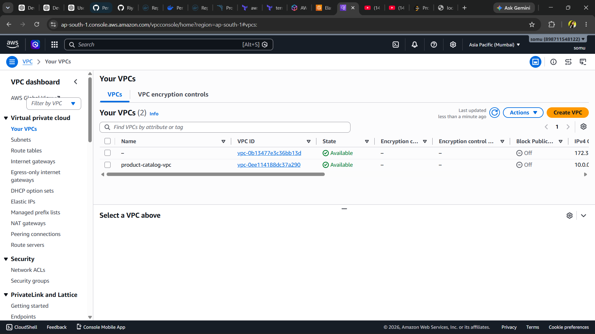

---

## Jenkins CI/CD Pipeline
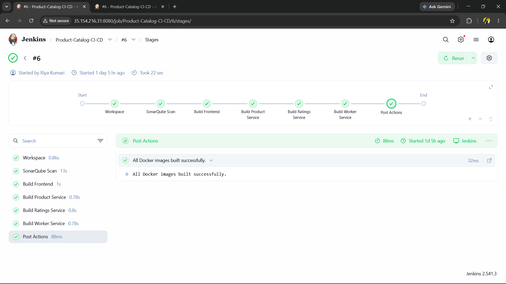

---

## Successful Jenkins Build
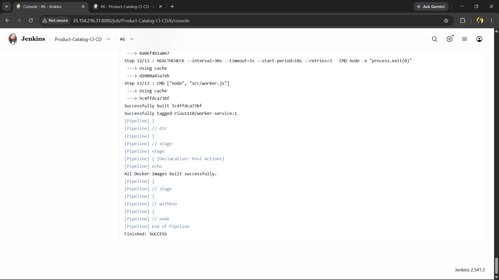

---

## SonarQube Code Analysis
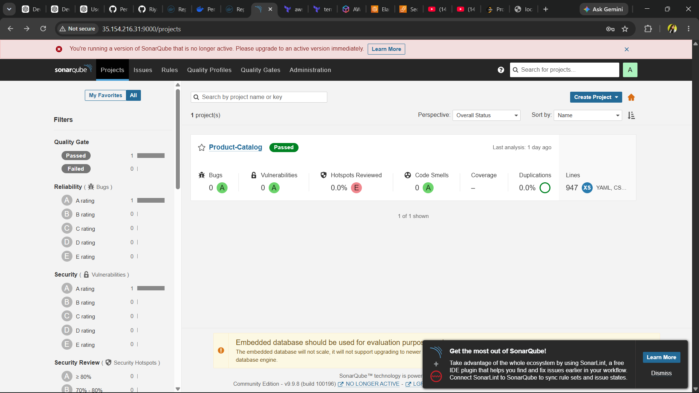

---

## DockerHub Images
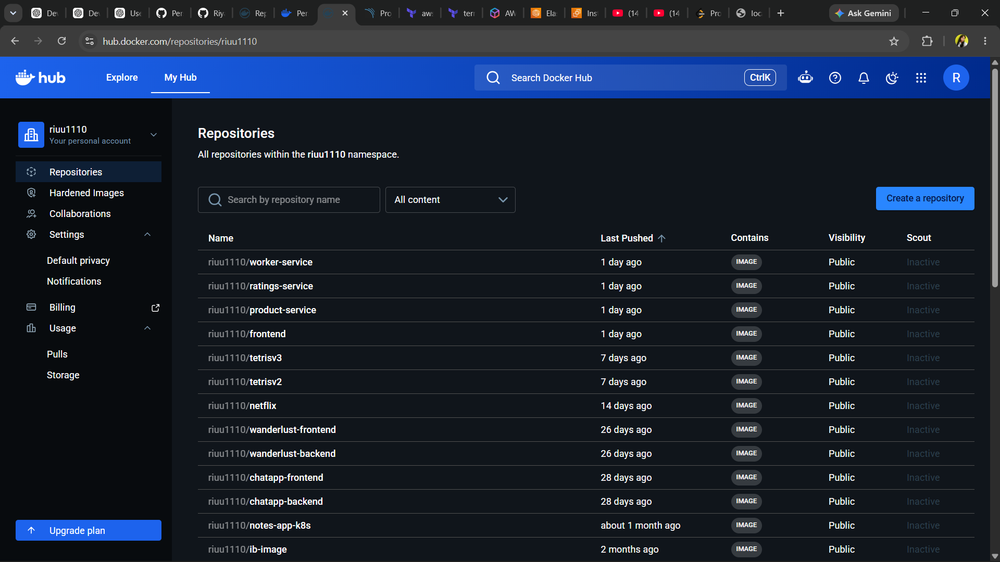

---

## ArgoCD Dashboard
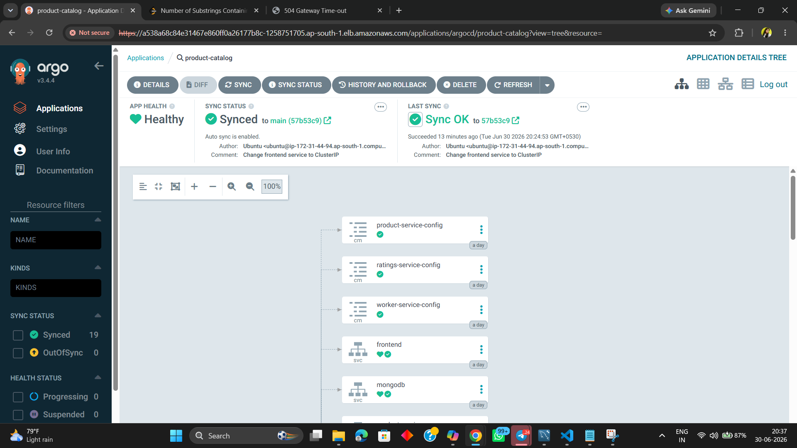

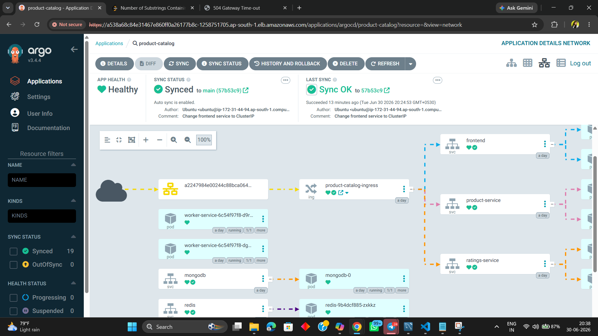

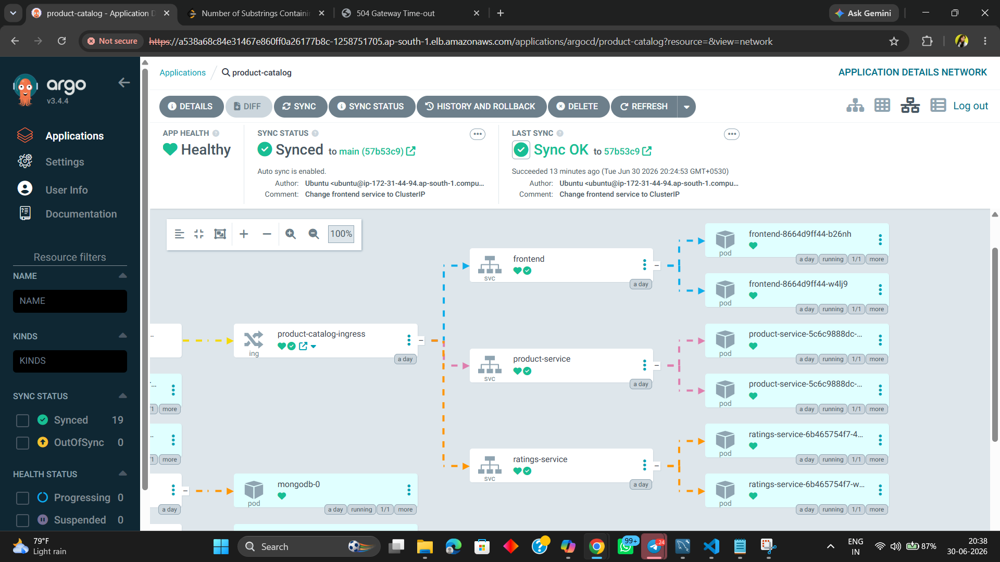

---

## Product Catalog Application
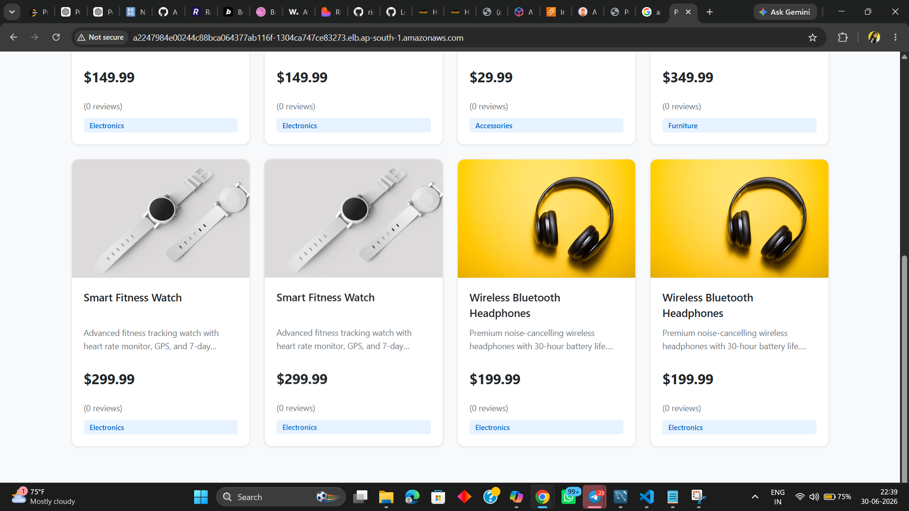

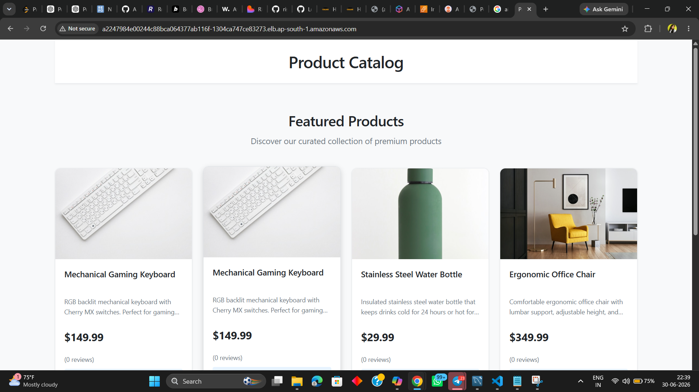

---

## AWS Load Balancer
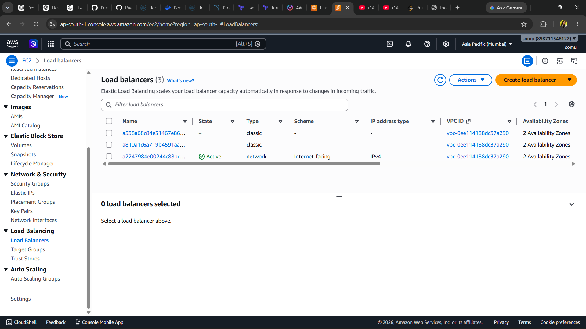

---

## Grafana Dashboard
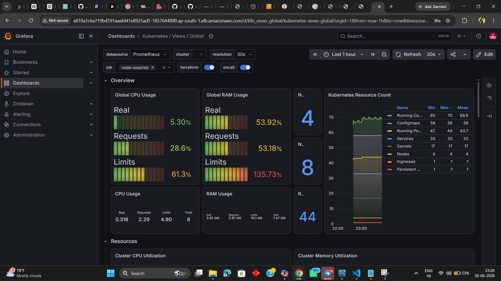

---

## Cluster CPU Monitoring
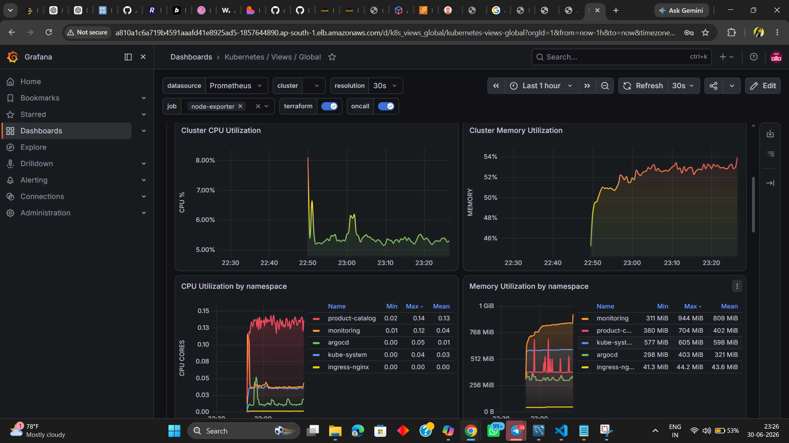

---

## Network Monitoring
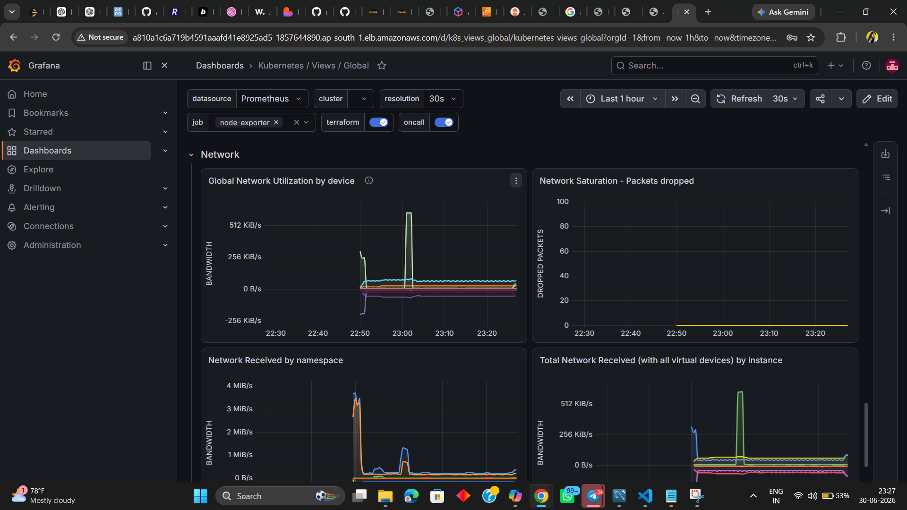

---

## Kubernetes Terminal
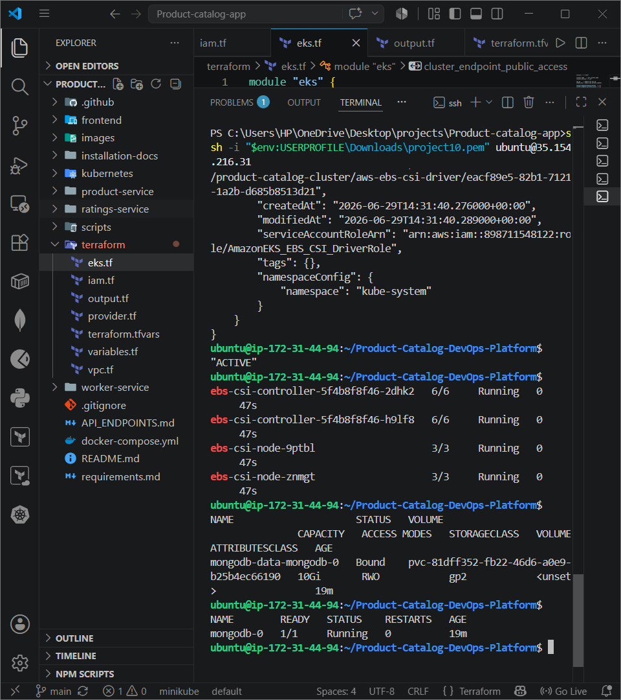

---

## GitHub Webhook
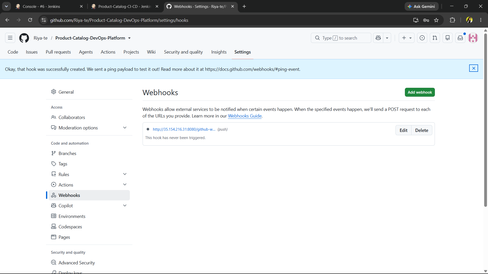

---

## Kubernetes Auto Scaling


---

# 👩‍💻 Author

**Riya Kumari**

B.Tech Computer Science Engineering

AWS | Docker | Kubernetes | Terraform | Jenkins | ArgoCD | Prometheus | Grafana | DevOps | Cloud Computing

---

# ⭐ If you found this project useful, don't forget to Star the repository!
